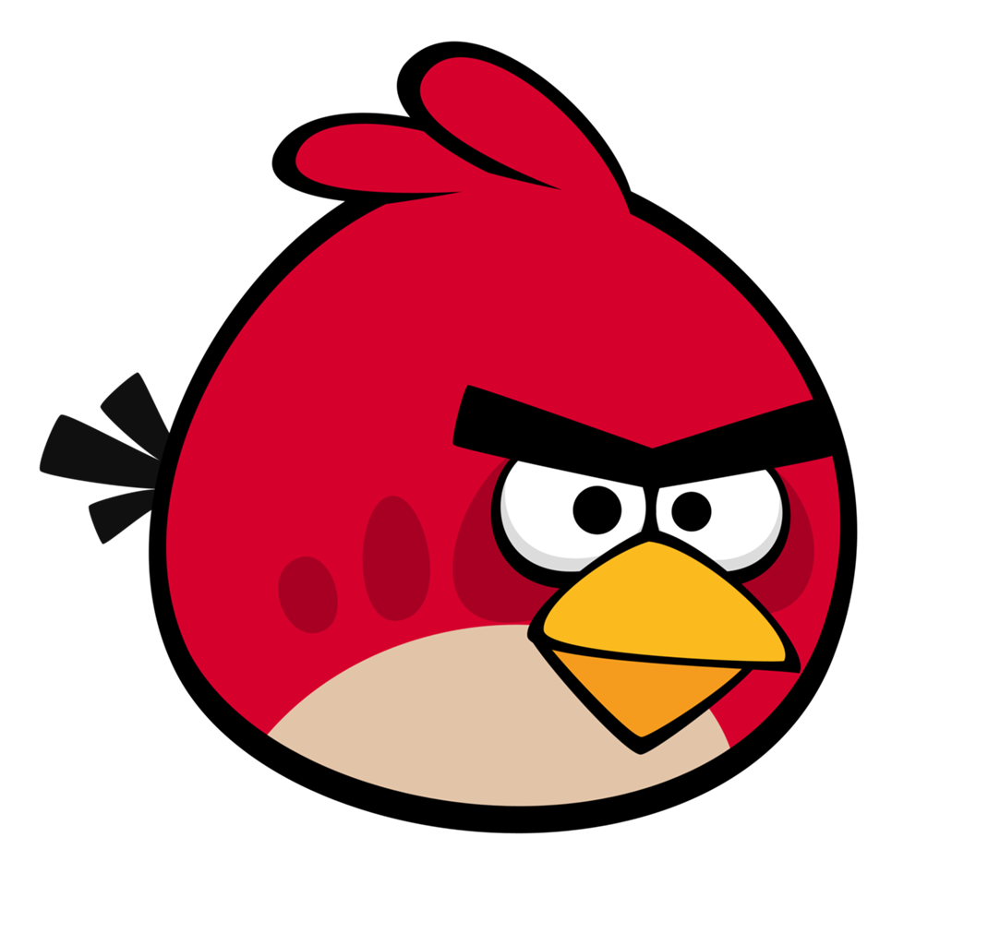

<!-- PROJECT LOGO -->
 

  

  <h3 align="center">Angry Birds</h3>

  

    A clone of the classic Rovio game - Angry birds, made with vanilla JavaScript!
     
     
    <a href="https://shrestha-rujal.github.io/angry-birds/">Play Demo</a>
    ·
    <a href="https://github.com/shrestha-rujal/angry-birds/issues">Report Bug</a>
    ·
    <a href="https://github.com/shrestha-rujal/angry-birds/issues">Request Feature</a>
  

<!-- ABOUT THE PROJECT -->
## About The Project

The project was developed without usage of any framework or libraries. Most components are rendered on the in-built canvas of Javascript.

### Built With

* [Vanilla JavaScript](#)
* [CSS3](#)
* [HTML5](#)

## Contact

Rujal Shrestha - rujal.shrestha00@gmail.com

* Demo Link: [https://razor381.github.io/angry-birds](https://shrestha-rujal.github.io/angry-birds/)
* Project Link: [hhttps://github.com/razor381/angry-birds](https://github.com/shrestha-rujal/angry-birds)
